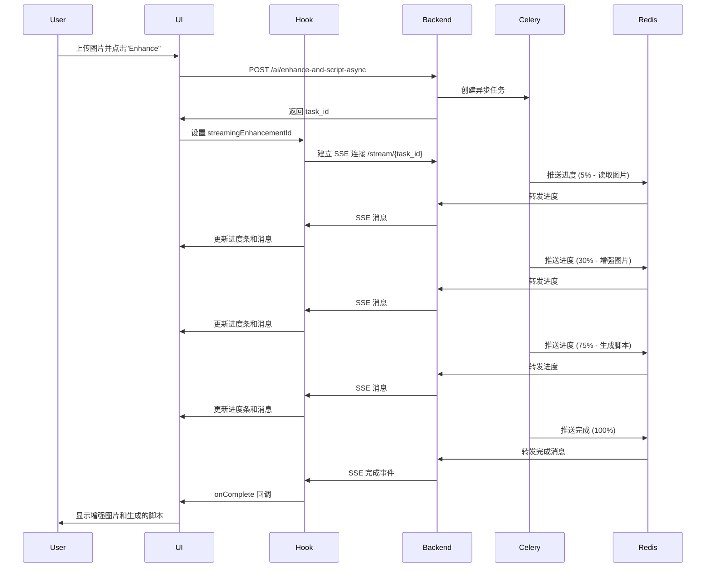

# Frontend SSE Enhancement Integration - 前端图片增强 SSE 实时进度集成

## 📋 实现总结

成功将前端与后端的 SSE 实时进度推送集成，实现了与视频生成相同的用户体验。

## 🎯 实现的功能

### 1. Custom Hook: `useEnhancementStream`

**文件**: `lib/hooks/useEnhancementStream.ts`

创建了与 `useVideoStream` 相同架构的自定义 Hook：

```typescript
export function useEnhancementStream({
  taskId,
  onComplete,
  onError,
  onProgress
}: UseEnhancementStreamOptions) {
  const [messages, setMessages] = useState<EnhancementStreamMessage[]>([]);
  const [isConnected, setIsConnected] = useState(false);
  const [progress, setProgress] = useState(0);

  // ... SSE 连接逻辑

  return {
    messages,
    isConnected,
    lastMessage,
    progress,  // 新增：进度百分比 (0-100)
  };
}
```

**特点**:
- ✅ 自动管理 EventSource 连接
- ✅ 实时进度更新 (0-100%)
- ✅ 自动处理完成/错误
- ✅ 连接状态监控
- ✅ 消息历史记录

### 2. API 服务函数

**文件**: `lib/api/services.ts`

添加了 2 个新的 API 函数：

#### 2.1 异步增强（SSE 支持）

```typescript
async enhanceAndGenerateScriptAsync(
  file: File,
  userDescription?: string,
  options?: { duration?: number; language?: string; }
): Promise<EnhancementTaskResponse>
```

**功能**:
- 立即返回 task_id
- 触发后台 Celery 任务
- 客户端使用 SSE 监听进度

#### 2.2 状态查询（轮询支持）

```typescript
async getEnhancementStatus(
  taskId: number
): Promise<EnhancementTaskStatusResponse>
```

**功能**:
- 获取任务当前状态
- 用于简单轮询或 SSE 断线后恢复

### 3. HeroSection 组件集成

**文件**: `components/HeroSection.tsx`

#### 3.1 导入 Hook

```typescript
import { useVideoStream } from "@/lib/hooks/useVideoStream";
import { useEnhancementStream } from "@/lib/hooks/useEnhancementStream";
```

#### 3.2 添加状态

```typescript
const [streamingEnhancementId, setStreamingEnhancementId] = useState<number | null>(null);
const [enhancementProgress, setEnhancementProgress] = useState<string>("Starting...");
```

#### 3.3 使用 SSE Hook

```typescript
const {
  messages: enhancementMessages,
  isConnected: isEnhancementConnected,
  lastMessage: lastEnhancementMessage,
  progress: enhancementProgressPercent
} = useEnhancementStream({
  taskId: streamingEnhancementId,
  onComplete: (result) => {
    // 设置增强图片
    setAiOptimizedImage(result.enhanced_image_url);
    // 填充脚本
    setPrompt(result.script);
    // 切换到视频生成阶段
    setWorkflowStage('video');
    // 显示成功提示
    showToast(tToast('scriptGeneratedSuccess'), "success");
  },
  onError: (error) => {
    showToast(error, "error");
    setIsGeneratingScript(false);
  },
  onProgress: (progress, message) => {
    setEnhancementProgress(message);
  }
});
```

#### 3.4 修改业务逻辑

**原同步版本**:
```typescript
const result = await aiService.enhanceAndGenerateScript(
  uploadedFile!,
  prompt,
  { duration: 4, language: locale }
);
// 直接处理结果...
```

**新异步版本**:
```typescript
const task = await aiService.enhanceAndGenerateScriptAsync(
  uploadedFile!,
  prompt,
  { duration: 4, language: locale }
);
// 启动 SSE 连接
setStreamingEnhancementId(task.id);
// Hook 会自动处理进度和完成
```

#### 3.5 UI 进度显示

添加了与视频生成相同的进度显示组件：

```typescript
{isGeneratingScript && (
  <div className="space-y-2">
    {/* 进度消息 + 连接状态 */}
    <div className="flex items-center gap-2 text-sm text-purple-600">
      <Loader2 className="w-4 h-4 animate-spin" />
      <span className="flex-1">{enhancementProgress}</span>
      {isEnhancementConnected && (
        <span className="flex items-center gap-1 text-xs text-green-600">
          <span className="w-2 h-2 bg-green-500 rounded-full animate-pulse"></span>
          Connected
        </span>
      )}
    </div>

    {/* 进度条 */}
    {enhancementProgressPercent > 0 && (
      <div className="w-full bg-gray-200 rounded-full h-2 overflow-hidden">
        <div
          className="bg-gradient-to-r from-purple-500 to-pink-500 h-full transition-all duration-300 ease-out"
          style={{ width: `${enhancementProgressPercent}%` }}
        />
      </div>
    )}

    {/* 历史消息日志 */}
    {enhancementMessages.length > 0 && (
      <div className="mt-2 space-y-1 max-h-32 overflow-y-auto text-xs text-gray-600 bg-white rounded-lg p-2 border border-gray-200">
        {enhancementMessages.slice(-5).map((msg, index) => (
          <div key={index} className="flex items-start gap-2 py-0.5">
            <span className="text-purple-500 font-mono text-[10px] mt-0.5">[{msg.progress}%]</span>
            <span className="flex-1">{msg.message}</span>
          </div>
        ))}
      </div>
    )}
  </div>
)}
```

## 🔄 完整工作流程

### 用户操作流程



### 关键进度点

| 进度 | 步骤 | 消息示例 |
|------|------|----------|
| 5% | 启动 | 🚀 Enhancement task started |
| 10% | 读取图片 | 📖 Reading original image... |
| 15% | 图片加载完成 | ✅ Image loaded (2.50MB) |
| 20% | 检测方向 | 📐 Detecting image orientation... |
| 25% | 检测完成 | ✅ Orientation: landscape (1280x720) |
| 30% | 开始增强 | 🎨 Enhancing image with gpt-image-1... |
| 50% | 增强完成 | ✅ Image enhanced (1536x1024) |
| 55% | 调整尺寸 | 📐 Resizing for video requirements... |
| 60% | 尺寸调整完成 | ✅ Image resized for video |
| 65% | 保存图片 | 💾 Saving enhanced image... |
| 70% | 保存完成 | ✅ Enhanced image saved |
| 75% | 生成脚本 | 🤖 Generating advertising script with GPT-4o... |
| 90% | 脚本生成完成 | ✅ Script generated (1250 characters) |
| 95% | 保存结果 | 💾 Saving results... |
| 100% | 完成 | 🎉 Enhancement completed successfully! |

## 📊 与视频生成 SSE 对比

| 特性 | 图片增强 SSE | 视频生成 SSE |
|------|-------------|-------------|
| **Hook** | `useEnhancementStream` | `useVideoStream` |
| **API 端点** | `/ai/enhance-and-script-async` | `/videos/generate` |
| **SSE 端点** | `/ai/enhance-and-script/{task_id}/stream` | `/videos/{video_id}/stream` |
| **进度字段** | `progress` (0-100) | `step` (0-9) |
| **消息格式** | `{ progress, message, enhanced_image_url, script }` | `{ step, message, video_url }` |
| **处理时间** | ~10-30 秒 | ~2-20 分钟 |
| **进度条** | ✅ 有（0-100%） | ❌ 无 |
| **历史日志** | ✅ 显示最近 5 条 | ✅ 显示最近 5 条 |
| **连接状态** | ✅ 显示绿点 | ✅ 显示绿点 |

## ✨ 用户体验改进

### 之前（同步版本）

```
用户点击按钮
    ↓
显示 Loading 动画
    ↓
等待 10-30 秒（黑盒）
    ↓
突然显示结果
```

**问题**:
- ❌ 用户不知道进展
- ❌ 可能以为卡住了
- ❌ 无法估计剩余时间

### 现在（SSE 版本）

```
用户点击按钮
    ↓
立即返回 task_id
    ↓
显示实时进度消息
📖 Reading original image... (10%)
🎨 Enhancing image... (30%)
🤖 Generating script... (75%)
✅ Completed! (100%)
    ↓
显示增强图片和脚本
```

**优点**:
- ✅ 实时进度反馈
- ✅ 用户知道系统在工作
- ✅ 可以看到每个步骤
- ✅ 进度条显示完成百分比
- ✅ 体验与视频生成一致

## 🔧 技术要点

### 1. SSE 连接管理

```typescript
useEffect(() => {
  if (!taskId) return;

  const token = localStorage.getItem('access_token');
  const streamUrl = `${apiUrl}/ai/enhance-and-script/${taskId}/stream?token=${token}`;
  const eventSource = new EventSource(streamUrl);

  eventSource.onmessage = (event) => {
    const data = JSON.parse(event.data);
    setProgress(data.progress);
    onProgress?.(data.progress, data.message);

    if (data.progress === 100 || data.status === 'completed') {
      onComplete?.(data);
      eventSource.close();
    }
  };

  return () => {
    eventSource.close();
  };
}, [taskId]);
```

### 2. 自动清理

- ✅ 组件卸载时自动关闭 SSE
- ✅ 任务完成时自动关闭连接
- ✅ 错误发生时自动清理资源

### 3. 错误处理

```typescript
eventSource.onerror = (error) => {
  console.error('SSE connection error:', error);
  eventSource.close();
  onError?.('Connection lost. Please try refreshing the page.');
};
```

## 📝 新增文件

1. **Hook**: `lib/hooks/useEnhancementStream.ts`
2. **文档**: `docs/FRONTEND_SSE_ENHANCEMENT_INTEGRATION.md`

## 🔄 修改文件

1. `lib/api/services.ts` - 添加异步 API 函数
2. `components/HeroSection.tsx` - 集成 SSE Hook 和 UI 更新

## 🎉 总结

成功实现了前后端的 SSE 实时进度集成：

1. ✅ **后端**: 完整的 SSE 架构（Celery + Redis + FastAPI）
2. ✅ **前端**: 自定义 Hook + API 服务 + UI 组件
3. ✅ **用户体验**: 实时进度反馈 + 进度条 + 历史日志
4. ✅ **一致性**: 与视频生成 SSE 使用相同的设计模式

现在用户可以实时看到图片增强和脚本生成的每个步骤，大大提升了用户体验！🚀
